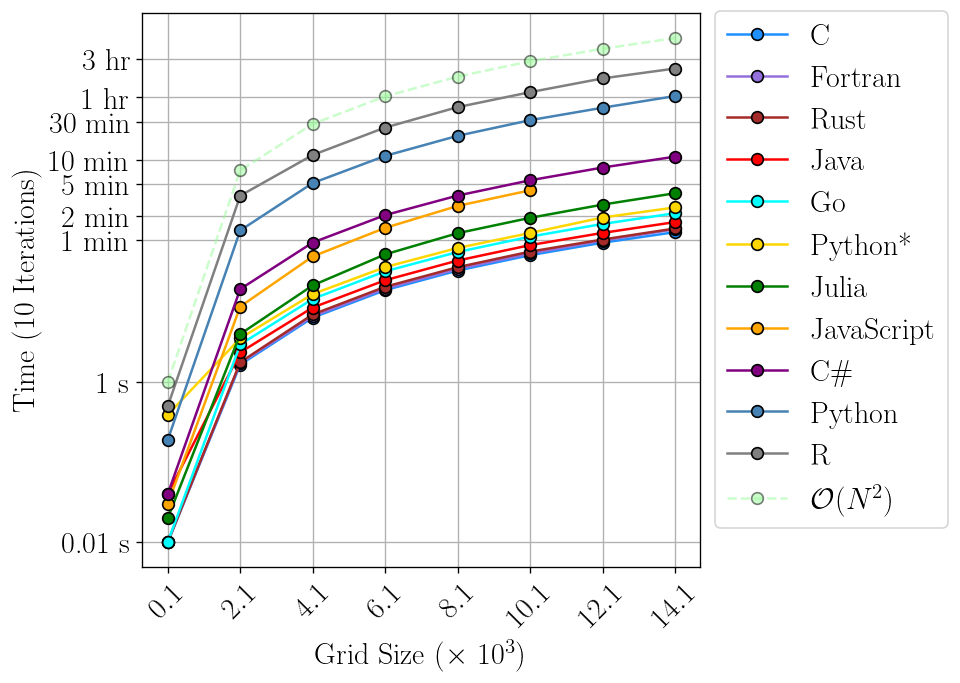

# Game of Life

| Language    | Command                            | Memory   | Lines | Characters | Time         |
| ----------- | -----------------------------------| -------- | ----- | ---------- | ------------ |
| C (O3)      | `./conways 500 500 1000`           | 3 Mb     |  92   |   2876     | 9.35 sec     |
| Fortran (Of)| `./conways 500 500 1000`           | 4 Mb     |  93   |   2690     | 9.94 sec     |
| Rust (O3)   | `./conways 500 500 1000`           | 4 Mb     |  87   |   2953     | 11.71 sec    |
| Java        | `java Conways 500 500 1000`        | 281 Mb   | 100   |   3309     | 13.88 sec    |
| Python (JIT)| `python conways.py 500 500 1000`   | 131 Mb   |  54   |   1637     | 19.76 sec    |
| Julia       | `julia conways.jl 500 500 1000`    | 131 Mb   |  56   |   1663     | 22.72 sec    |
| JavaScript  | `node conways.js 500 500 1000`     | 120 Mb   |  80   |   2333     | 46.46 sec    |
| C#          | `./conways.exe 500 500 1000`       | 40 Mb    |  96   |   3496     | 1 min 13 sec |
| Python      | `python conways.py 500 500 1000`   | 85 Mb    |  52   |   1582     | 7 min 15 sec |
| R           | `Rscript conways.r 500 500 1000`   | 86 Mb    |  53   |   1805     | 16 min 11 sec|

## Scalability

  

## Random

  

## Glider Gun

  

